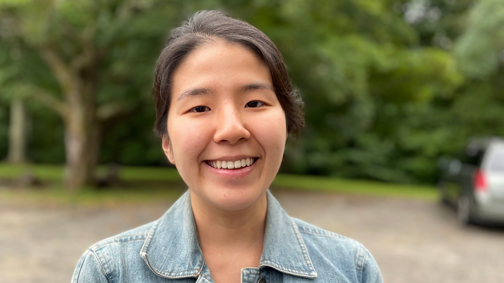
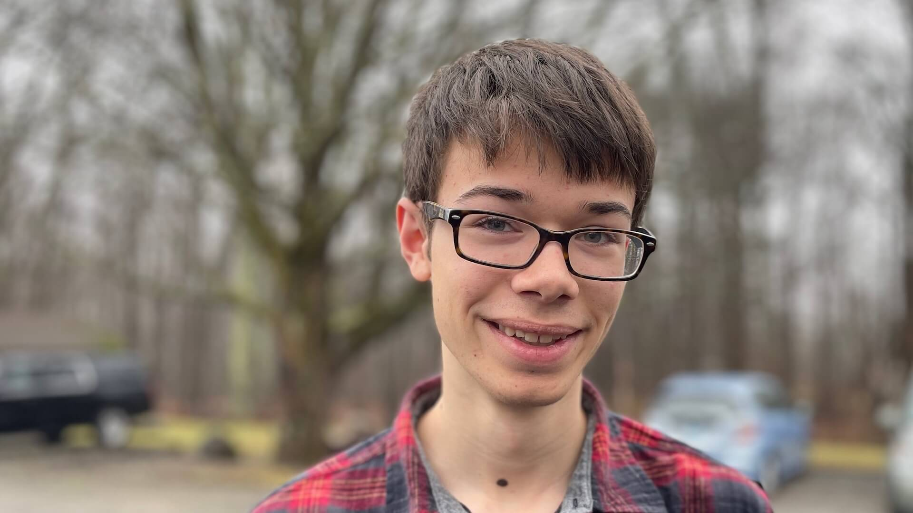

# Will Snyder

## Senior Pastor

John William (Will) Snyder began his ministry as Senior Pastor at the Presbyterian Church of Coventry in January 2019. Previously, he served as Senior Pastor of the Forks of the Brandywine Presbyterian Church (EPC) from 2010 -2018, following his service as pastor of an independent reformed church in southern Michigan from 2005-2010. A native of the northwest, (Kent, WA) Will received a BA from Western Washington University. Afterward, he moved with his family to Florida where he earned a Masters’ in Divinity at Reformed Theological Seminary (Orlando). During his first pastorate he began further studies at Reformed Presbyterian Theological Seminary in Pittsburgh, PA, where he earned his Doctor of Ministry degree in 2015. Will and his wife Shelley, along with their children Natalie, Alivia, and Pierson live in Vernon, CT

# Hannah Moon Sung

## Women's Discipleship Coordinator

Originally from New York City, Hannah began attending PCC in 2016 when she moved for work as a RUF intern at UConn. After serving in college ministry for three years, she moved to St. Louis, Missouri to pursue a Masters of Divinity and of Arts in Counseling at Covenant Theological Seminary. With one year of seminary under her belt, she returned to Connecticut in 2020 to serve as a summer ministry intern at PCC. Resuming her degrees online, she continues to invest in her church community, fostering friendships and encouraging life-on-life relationships. She is married to Andrew Sung and often dreams of owning a Welsh Corgi named Toast.

# Danielle Bolliger

## Church Secretary

Danielle has been a member of PCC since 2010. She became the Church Administrator in May of 2017. Danielle has been married to Deacon Scott Bolliger since 1984. They live in Tolland with their two children, Hannah and Evan, and one dog – their rescue, Abby. Danielle enjoys spending time with her family, hiking, riding bikes, or venturing into Boston for a Red Sox game. A favorite Bible verse: _Fear not, for I am with you; be not dismayed, for I am your God; I will strengthen you, I will help you, I will uphold you with my righteous right hand._ Isaiah 41:10

# Benjamin Bassett

## Media Coordinator

Ben Bassett has been a member of PCC since 2015, and is currently 17 years old. He undertook the position of media coordinator in July of 2021, and has been enjoying the various challenges it presents him with and the service he has been able to provide. He resides in Tolland CT with his parents and three sisters on a homestead, where they keep alpacas, bees, chickens, and occasionally pigs. Ben enjoys reading, programming, running, and learning new things. He is homeschooled through Classical Conversations, where he particularly delights in debate, literature, and math. A verse which continually encourages Ben is Romans 8:28: _And we know that for those who love God all things work together for good, for those who are called according to His purpose._

# Elders

Armand Chenelle, Doug Fox, Sterling Harmon Jr., Richard Jones, John Sundet, Scott Warren, Brian Wilson

# Deacons

Peter Benedict, Scott Bolliger, Howard Craig, Jeff Edwards, Walter Mayo, and David Embree. Deacon Emeritus: Mark Franson, Randy Hershberger.
