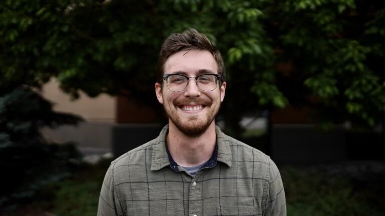

# Will Snyder

## Senior Pastor

John William (Will) Snyder began his ministry as Senior Pastor at the Presbyterian Church of Coventry in January 2019. Previously, he served as Senior Pastor of the Forks of the Brandywine Presbyterian Church (EPC) from 2010 -2018, following his service as pastor of an independent reformed church in southern Michigan from 2005-2010. A native of the northwest, (Kent, WA) Will received a BA from Western Washington University. Afterward, he moved with his family to Florida where he earned a Masters’ in Divinity at Reformed Theological Seminary (Orlando). During his first pastorate he began further studies at Reformed Presbyterian Theological Seminary in Pittsburgh, PA, where he earned his Doctor of Ministry degree in 2015. Will and his wife Shelley, along with their children Natalie, Alivia, and Pierson live in Vernon, CT

# David Augustine

## RUF Pastor

David Augustine began as the RUF campus associate for UCONN in June 2023. David was a member of RUF at the University of Pittsburgh where he graduated with a bachelor’s degree in neuroscience in 2018. After working for one year as a research laboratory technician he moved to St Louis to attend Covenant Theological Seminary, graduating in 2022 with an MDiv. While in St Louis he was a ministry intern at South City Church where he helped teach adult Sunday School and co-led the youth group. He then worked as interim campus associate for RUF at Indiana University of Pennsylvania for the ’22-’23 school year. He enjoys spending time outdoors, reading, and getting competitive over just about anything.

# Danielle Bolliger

## Church Secretary

Danielle has been a member of PCC since 2010. She became the Church Administrator in May of 2017. Danielle has been married to Deacon Scott Bolliger since 1984. They live in Tolland with their two children, Hannah and Evan, and one dog – their rescue, Abby. Danielle enjoys spending time with her family, hiking, riding bikes, or venturing into Boston for a Red Sox game. A favorite Bible verse: _Fear not, for I am with you; be not dismayed, for I am your God; I will strengthen you, I will help you, I will uphold you with my righteous right hand._ Isaiah 41:10

# Elders

Armand Chenelle, Doug Fox, Sterling Harmon Jr., Richard Jones, John Sundet, Scott Warren, Brian Wilson

# Deacons

Peter Benedict, Scott Bolliger, Howard Craig, Jeff Edwards, Walter Mayo, and David Embree. Deacon Emeritus: Mark Franson, Randy Hershberger
