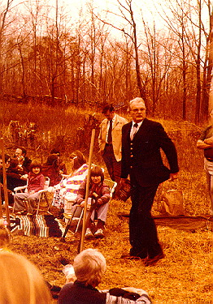

Every person has a life-story filled with joys and happiness as well as brokenness and pain. The uniqueness of the church can be seen as God weaves together individual life-stories into his grand narrative of redemption—the story of God’s redeeming grace in the person and work of Jesus Christ. That is the story of the Presbyterian Church of Coventry (PCC).

Founded in 1973, the congregation began as a daughter church of The Presbyterian Church of Manchester. Served by their founding pastor, Dr. Richard Gray, PCC met for 9 years at the Coventry Grammar School. After the church purchased property on which they planned to build, they called Dr. Brad Evans in 1980. As the church continued to grow, PCC expanded to include an education wing in 1984.

From 1997- 2009, PCC either hosted or sponsored the Connecticut Valley Conference on Reformed Theology (CVCRT). Over the years our church outgrew its multi-purpose fellowship hall, and so undertook another major building program. We purchased more land adjacent to the Trowbridge property and completed a dedicated sanctuary in 2003.

Pastor Brad Evans faithfully served PCC for 38 years, assisted by two Pastors: Robert Cox (assistant pastor—2001-2004) and Larry Bowlin (associate pastor—2012-2018). The church has also been blessed by the ministry of RUF (Reformed University Fellowship), serving the nearby college students at UCONN and having seen several become members of PCC. Pastor Joseph Pensak served as campus minister from 2004-2011, and Pastor Lucas Dourado has been serving since 2011.

Following the retirement of Pastor Evans, Pastor Bill Clark was called to serve as interim pastor, beginning his ministry in February 2018 as PCC entered a new season of life. During 2018 Pastor Will Snyder was called to serve as Senior Pastor, and he began his ministry at PCC in January 2019.
