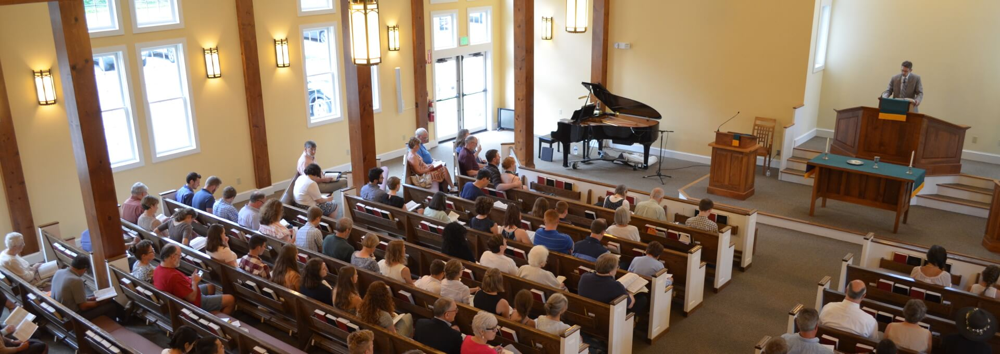

# Worship

Worship is central to the life of the Presbyterian Church of Coventry and aims to be God-glorifying and Christ-exalting in all aspects. The Sunday morning worship service begins at **10:30** AM in the sanctuary.

While our worship may be characterized as predominantly classical and traditional in style, our greatest conviction is for our worship to be biblical. Many people may be unfamiliar with the use of a structured liturgy (order) in worship. The word liturgy means “the work of the people”, which points us toward worship as an act before that of an experience. The experience comes as a result of the act—for we have come to do something (worship), and the blessings we receive are in response to what we have given.

# Order

The worship service consists of the following: Call to Worship, prayers, singing, time of silent confession of sin, Old and New Testament readings, an offering, and a sermon followed by a benediction.

Announcements are made at the end of the service following the benediction.

The doors from the narthex to the Sanctuary are closed during the worship service. Out of respect, we ask that you refrain from entering the sanctuary during prayer times and during scripture readings.
For security purposes, the outside doors in the back of the building are locked once the worship service begins and again during Sunday school. If you arrive during these times, please enter the building through the narthex or the fellowship hall.

Overflow seating is available in the fellowship hall. The service can be viewed and heard through a monitor and speaker located in this room.

# Communion

We celebrate communion on the first and third Sundays of the month during the morning worship service. Communion is open to all those who are believers in Christ and who are members in good standing within an evangelical church. On communion Sundays, an additional Deacon’s offering is taken to help those in our congregation and community who have needs. We serve both wine and grape juice during communion. Grape juice is provided in the outer ring of each tray.

# Nursery

Nursery care is provided in the nursery located in the education section of the building. Care is provided for infants and small children (up to age 3). For more information please visit our [nursery information page](/about/nursery).

# Sunday School & Fellowship

Sunday school for all ages meets prior to the Sunday worship service at 9:30 AM and ends at 10:15 AM. There are usually 2-4 choices of adult Sunday school classes.

There is a brief time for conversation, fellowship, and hot drinks (coffee, tea, hot chocolate) in the fellowship hall immediately after Sunday school and before the worship service.

---

If you have questions, please feel free to ask anyone.

We welcome you to join us for worship.
