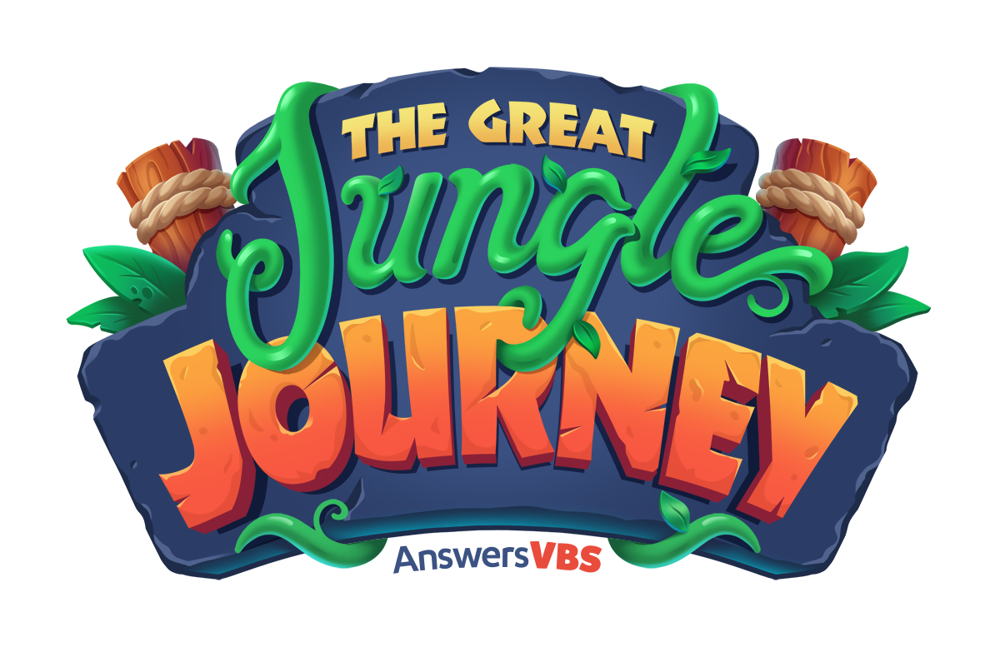

# Vacation Bible School

**Dates:** Monday, July 29st – Friday, August 2th, 9am-12pm

**Location:** Presbyterian Church of Coventry

Please join The Presbyterian Church of Coventry for this week of fun featuring Bible lessons, crafts, games, music, and snacks!

"The Great Jungle Journey" is a Vacation Bible School program for children ages 4-12 years old.

There is NO registration fee to attend Vacation Bible School.

Here are a few things to know before VBS kicks off:

- Please wear sneakers for recreation.
- All volunteers are trained and qualified with child safety being the utmost priority.
- Missions Project: supporting blind and low-vision individuals in Chile (CEMIPRE). Feel free to send them with coins to contribute to the donation; the coins really add up over the week!
- Parents, guardians, and siblings are invited to join us for our closing program on Friday, starting at 11:30. Afterwards, please join us for pizza, popsicles, and a time of fellowship (free of charge).

_To register, please fill out [our online form here](https://form.jotform.com/241076229816055)._

Please fill out the registration form by **JULY 21st**.
