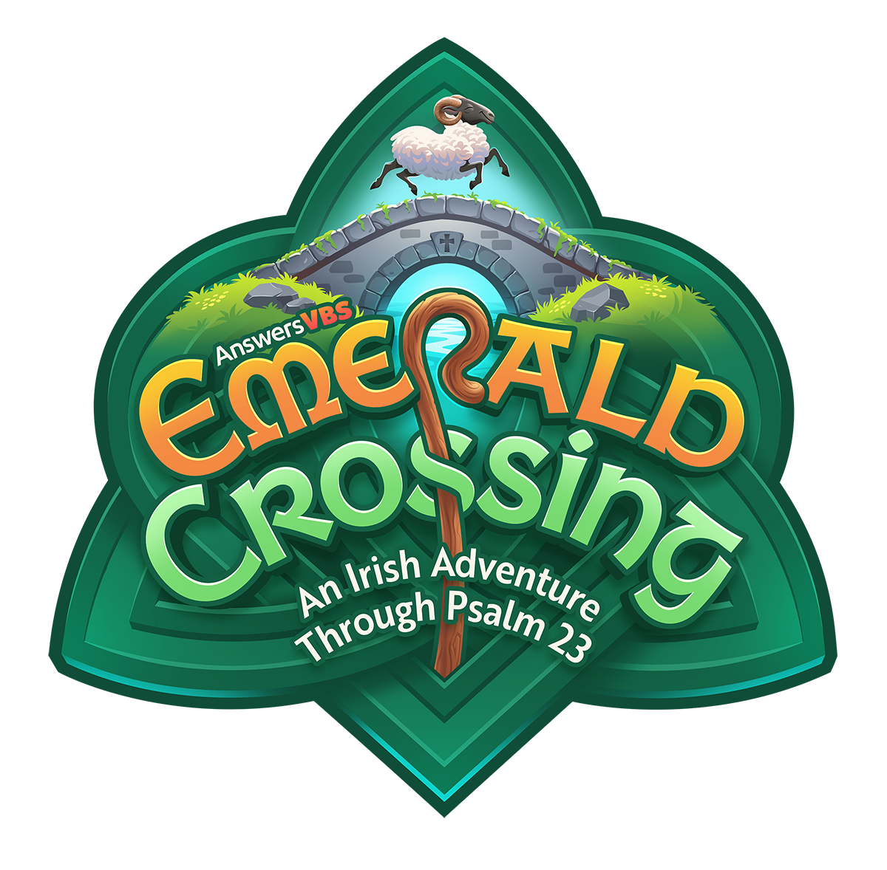

# Vacation Bible School

**Dates:** Monday, August 3rd – Friday, August 7th, 2026, 9am-12pm

**Location:** Presbyterian Church of Coventry - 55 Trowbridge Rd, Coventry CT 06238

Please join The Presbyterian Church of Coventry for this week of fun featuring Bible lessons, crafts, games, music, and snacks!

In a world filled with worry and confusion, kids need to know there is a God who cares for them. At Emerald Crossing, they’ll journey through Ireland’s lush landscapes, exploring the powerful words of Psalm 23. They’ll discover the life of the shepherd-king David and will learn how to cross from worry to peace, from fear to faith, and from uncertainty to a firm foundation in God’s Word through a relationship with the Good Shepherd.

This VBS program is intended for children aged 4-12 years old.

There is NO registration fee to attend Vacation Bible School.

Here are a few things to know before VBS kicks off:
- All children aged 4-12 are welcome to attend! Church membership is not required.
- All volunteers are trained and qualified with child safety being the utmost priority.
- Children are encouraged to wear sneakers for comfort during games and traveling between rooms.
- Each day, we'll collect a donation to support a missions project (either a missionary or a ministry), which we'll learn about throughout the week. Children are encouraged to bring coins to contribute to the donation; the coins really add up over the week!
- Parents, guardians, and siblings are invited to join us for our closing program on Friday, starting at 11:30. Afterwards, please join us for pizza, popsicles, and a time of fellowship (free of charge).

_To register, please fill out [our online form here](https://form.jotform.com/261558071636158)._

There is no deadline for registration. Families are strongly encouraged to register beforehand but can also register day-of.

We cannot wait to see you at Emerald Crossing this year!