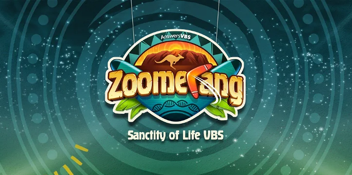

# Vacation Bible School

**Dates:** Monday, August 1th – Friday, August 5th @ 9am-12pm

**Location:** Presbyterian Church of Coventry

Please join The Presbyterian Church of Coventry for this week of fun featuring Bible lessons, crafts, games, music, and snacks!

"Zoomerang" is a Vacation Bible School program for children ages 4-12 years old (at the start
of VBS).

There is NO registration fee to attend Vacation Bible School.

Here are a couple of things to know before VBS begins:

- Please wear sneakers for recreation.
- This year we will be taking up a collection for the Caring Families Pregnancy Center in
  Willimantic, CT. Caring Families serves the community by providing spiritual, emotional,
  educational, and material support to women and men seeking help with pregnancy-
  related issues. Please consider sending your child in with a few coins each day to
  support this vital mission in our own backyard. Every little bit helps, and the coins really
  add up!
- Parents and siblings are invited to join us for our closing program on Friday, starting at
  11:30. After that please plan to join us for pizza, popsicles, and a time of fellowship.
  There is no charge for the pizza or popsicles.

_To register, please fill out our online form here:_ https://form.jotform.com/221658951981165

Please fill out the registration form by **JULY 20th**.
